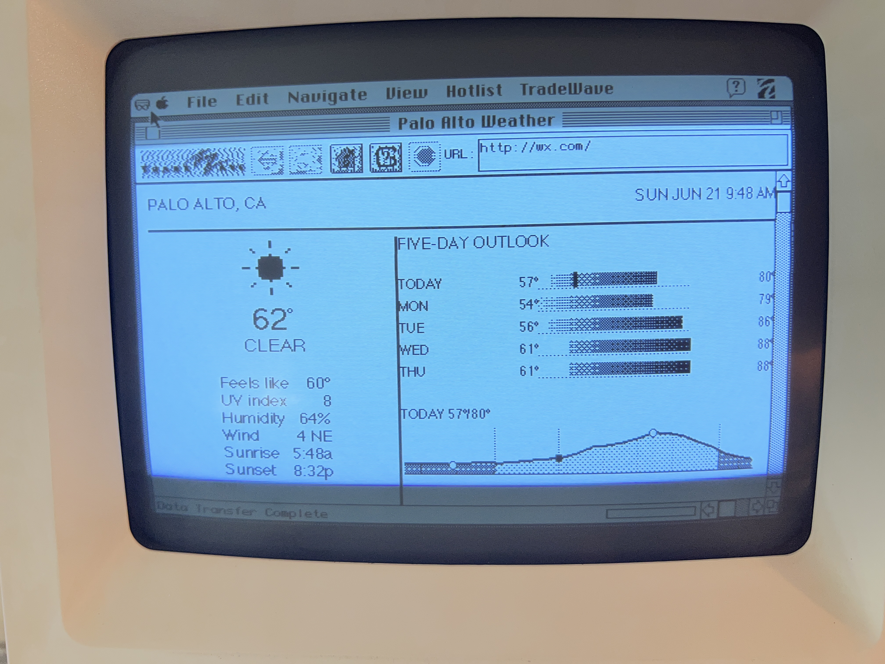

# se-weather

A self-updating **weather display for a Macintosh SE** (System 7.1), built as a
[macproxy](https://github.com/rdmark/macproxy_classic) extension and optimized for the
SE's 512×342, 1-bit screen. The vintage Mac browses to `http://wx.com/` and shows a
glanceable current-conditions + 5-day-forecast page with hand-dithered 1-bit weather
graphics, and it **reloads itself every few minutes with no keyboard or mouse attached**.



```
Open-Meteo API ──> wx extension (this repo, runs inside macproxy on a modern Mac)
                       │  renders an SE-optimized page: HTML text + inline 1-bit XBM graphics
                       ▼  HTTP over Wi-Fi (DaynaPORT)
                  Macintosh SE / MacWeb 2.0  ──reloads on a timer via KeyQuencer
```

This README is the full, reproducible build. It has four parts:
1. **[How it works](#how-it-works)** — the architecture and the rendering pipeline.
2. **[Server side](#part-1--server-side-the-proxy--weather-extension)** — the proxy + weather extension.
3. **[Vintage Mac networking & browser](#part-2--vintage-mac-networking--browser)** — get the SE online and pointed at the proxy.
4. **[Hands-off auto-reload](#part-3--hands-off-auto-reload-keyquencer)** — make it a true unattended display.

Plus a **[MacWeb 2.0 field guide](#macweb-20-field-guide-hard-won-gotchas)** — the hard-won,
mostly-undocumented browser quirks that shaped every design decision here. If you're building
*anything* for a 68000-era Mac browser, that section is the most valuable part of this repo.

---

## Hardware / software used

- **Macintosh SE** — Motorola **68000** @ 8 MHz, **4 MB RAM**, 512×342 1-bit screen, System **7.1**.
- **ZuluSCSI Pico W** (must be the **W** / RP2040W variant) emulating a **DaynaPORT SCSI/Link**
  Wi-Fi Ethernet adapter. *(BlueSCSI v2 with a Pico W works the same way.)*
- A **2.4 GHz Wi-Fi** network (the Pico W has no 5 GHz radio).
- A **modern Mac** on the same LAN to run the proxy (kept on whenever you want the display live).
  A Mac is preferred because the renderer uses the Mac's own Geneva/Monaco fonts.
- Software the SE needs (all free; sources in Part 2): **MacTCP**, the **DaynaPORT 7.5.3** driver,
  **MacWeb 2.0**, **KeyQuencer**.

---

## How it works

MacWeb 2.0 on a 68000 is *extremely* limited: **no JavaScript, no CSS, no `<canvas>`, and no
inline GIF/JPEG** (it hands those to a helper app). The one rich thing it *can* do inline is the
**XBM** (X BitMap) format — a 1-bit image. So the display is a deliberate **hybrid**:

- **Text** (location, time, big temperature, conditions, stat labels) is plain HTML rendered by
  the SE itself, using its built-in **Chicago / Geneva / Monaco** fonts (`<font face=…>`). This
  is tiny over the wire and crisp on screen.
- **Graphics that can't be done in text** — the weather icons, the cool→warm dithered 5-day
  range bars, and the day/night temperature graph — are generated server-side as small **1-bit
  XBM images** and embedded with ``.

The server-side renderer (`wx/render.py`) is the project's "dithering module": it draws into an
8-bit buffer and thresholds to 1 bit, with **ordered (Bayer) dithering** for all shading — the
same technique you'd bake into a GIF, here emitted as XBM so MacWeb shows it inline.

### Files

| File | Role |
|---|---|
| `wx/wx.py` | The macproxy extension. Fetches Open-Meteo, builds the hybrid HTML page, and serves each XBM component on its own URL. |
| `wx/render.py` | The 1-bit renderer: Bayer dither, weather icons, range bars, the temperature graph, and the combined 5-day forecast image. Uses Pillow. |
| `wx/fonts/` | Chicago / Geneva / Monaco TrueType, used by `render.py` to bake text into the images so it matches the on-screen fonts. |

### Request map (all under `http://wx.com/`)

| Path | Returns |
|---|---|
| `/` | The live hybrid HTML page (text + `` references below). |
| `/comp-icon.xbm` | Current-conditions weather icon (48 px). |
| `/comp-forecast.xbm` | The **entire** 5-day block as one image (day names + icons + dithered bars + lo/hi). |
| `/comp-graph.xbm` | The day/night dithered temperature graph for today. |
| `/comp-rule.xbm`, `/comp-vrule.xbm` | Thin black divider bars (see the `<hr>` gotcha below). |
| `/text` | A pure-ASCII, image-free fallback page (fastest, ugliest). |
| `/pixel` | The whole screen as a single full-size image (heavy; for emulators / 68020+ Macs). |
| `/wx.{xbm,gif,pbm,bmp}` · `/img-test` | Format probes used to discover what MacWeb can inline. |

> **Why one big forecast image instead of per-row images?** MacWeb drops images when a page has
> too many inline `` tags. Collapsing the 5-day block (which was ~11 little images) into a
> single `comp-forecast.xbm` keeps the whole page down to **5 image fetches**, comfortably under
> the limit. See the field guide.

---

## Part 1 — Server side: the proxy + weather extension

1. Install and run [macproxy_classic](https://github.com/rdmark/macproxy_classic) on the LAN
   machine (it's a Flask app; `./start_macproxy.sh` sets up a venv and runs it on port **5001**).

2. Drop this extension into macproxy's `extensions/` folder. A **symlink** keeps it editable
   from this repo:
   ```sh
   ln -s /path/to/se-weather/wx  /path/to/macproxy_classic/extensions/wx
   ```

3. Enable it in macproxy's `config.py`:
   ```python
   ENABLED_EXTENSIONS = [ ..., "wx" ]
   ```

4. Install Pillow into macproxy's venv (the renderer needs it):
   ```sh
   /path/to/macproxy_classic/venv/bin/pip install Pillow
   ```

5. Set your location and preferences at the top of [`wx/wx.py`](wx/wx.py):
   ```python
   LATITUDE      = 37.4419
   LONGITUDE     = -122.1430
   LOCATION_NAME = "PALO ALTO, CA"
   TIMEZONE      = "America/Los_Angeles"
   ```
   Data comes from [Open-Meteo](https://open-meteo.com) — free, no API key. The extension caches
   each fetch for 120 s, so one page reload (which pulls several images) makes a single API call.

6. Restart macproxy and sanity-check from the LAN machine:
   ```sh
   curl -x http://localhost:5001 http://wx.com/            # the HTML page
   curl -x http://localhost:5001 http://wx.com/comp-graph.xbm | head   # an XBM
   ```

> **Gotcha — the domain must use a real TLD.** The extension's `DOMAIN` is **`wx.com`**, not
> something like `wx.box`. MacWeb 2.0 refuses to treat made-up TLDs as valid URLs and mangles
> them into a broken `http://<proxy-ip>/http://wx.box/` request. `wx.com` is a real TLD the SE
> never needs to visit for real, so the extension safely shadows it.

The page is returned as a Flask `Response`, so macproxy passes it through **without** its usual
tag-stripping/image-reprocessing — the hand-built 1-bit layout and XBM bytes stay intact.

---

### Running on a Raspberry Pi (always-on host)

A Pi is the natural always-on home for the proxy. Two scripts in [`deploy/`](deploy/) handle it:

```sh
# on the Pi (Raspberry Pi OS / Debian), as your normal user:
git clone <your se-weather repo>
cd se-weather
./deploy/provision-pi.sh
```

`provision-pi.sh` is idempotent and does the whole setup:
1. installs system packages (python3/venv + Pillow's libs incl. **libfreetype6** for TrueType),
2. clones **macproxy_classic** alongside this repo,
3. symlinks `wx/` into `macproxy_classic/extensions/` and enables it in `config.py`,
4. creates the venv and installs all dependencies (and smoke-tests the renderer),
5. installs and starts a **systemd service** (`macproxy-wx`) that **starts on boot and restarts
   on crash** (`Restart=always`).

Manage it with:
```sh
sudo systemctl status macproxy-wx     # is it running?
journalctl -u macproxy-wx -f          # live logs
sudo systemctl restart macproxy-wx    # restart
```

The bundled Chicago/Geneva/Monaco fonts mean the renderer works on the Pi's Linux with no extra
font setup. The systemd unit is also provided as a reference at
[`deploy/macproxy-wx.service`](deploy/macproxy-wx.service).

#### Optional: touchscreen status panel

If the Pi has a small touchscreen (~4.3"), [`statusui/status_app.py`](statusui/status_app.py)
is a lightweight **pygame** panel that shows **how long since the Macintosh SE last pinged the
proxy** (color-coded), the proxy service state, internet connectivity, the Pi's `IP:PORT`, the
request count, and the current temperature — plus touch buttons: **Restart Proxy**, **Refresh
Weather** (clears the 120 s cache), and **Test Network**.

It works because the proxy is the thing the SE talks to: the extension writes a small
`/tmp/wx-status.json` on every request, and the panel just reads it (it never imports the proxy).

On **Raspberry Pi OS Desktop**:
```sh
./deploy/provision-statusui.sh     # installs pygame, a sudo rule, and the autostart entry
```
It launches the panel immediately (if run from the desktop) and auto-starts it on every desktop
login. A small wrapper (`statusui/run-panel.sh`) **restarts the app if it crashes** and logs to
`~/se-weather-status.log` — check that file if the screen stays blank.

> **Why a desktop autostart and not a systemd service?** The panel is a GUI app: it needs the
> desktop session's display environment (`DISPLAY`/`WAYLAND_DISPLAY`). A desktop autostart runs
> *inside* that session so the display "just works", whereas a plain systemd service starts
> before/outside the session and typically can't open the screen. The wrapper gives it the
> restart-on-crash resilience you'd otherwise want a service for.

To try/debug it manually on the touchscreen's own terminal (not over SSH — it needs the display):
```sh
python3 statusui/status_app.py     # prints why it can't open the display, if it can't
tail -f ~/se-weather-status.log    # what the autostarted copy is doing
```
Env vars `WX_STATUS_FILE`, `WX_REFRESH_FLAG`, `WX_SERVICE`, `WX_PORT` override the defaults.

> **After moving the proxy to the Pi:** give the Pi a **static/reserved IP**, and update the SE's
> MacWeb proxy **Host** to that IP (Part 2d). MacWeb hard-codes the proxy address, so a changing
> DHCP lease silently breaks the display.

---

## Part 2 — Vintage Mac networking & browser

### 2a. ZuluSCSI DaynaPORT Wi-Fi

On the SD card root, alongside your disk images:

- Create an **empty file named `NE4.img`** — this assigns SCSI ID 4 as the DaynaPORT network device.
- In `zuluscsi.ini`, put your Wi-Fi credentials in the `[SCSI]` section:
  ```ini
  [SCSI]
  WiFiSSID = "YourNetwork"
  WiFiPassword = "YourPassword"
  ```
- Boot the SE; check `zululog.txt` on the card afterward — it should say
  `Successfully connected to Wi-Fi`.

### 2b. DaynaPORT driver

Install the **DaynaPORT 7.5.3** driver on the SE.

> **Gotcha — use Custom install.** Run the Dayna Installer and choose **Customize →
> "DaynaPORT SCSI/Link"** (install *only* that). The default "Easy Install" picks the wrong
> components and MacTCP will then show only **LocalTalk**. After the Custom install + restart,
> MacTCP shows an **"Ethernet Built-in"** option — that's the DaynaPORT link.

### 2c. MacTCP (System 7.1 has no DHCP — set a static IP)

Apple menu → Control Panels → **MacTCP**:
- Select **Ethernet Built-in**, click **More…**
- **Obtain Address: Manually**
- **IP Address:** e.g. `192.168.0.234`
- **Router/Gateway:** your router, e.g. `192.168.0.1`
- **Subnet Mask:** `255.255.255.0`
- **Domain Name Server:** domain `.`, IP `1.1.1.1`, set as Default
- Close MacTCP (it saves) and **restart**.

Verify with **MacTCP Ping** to your proxy machine's IP.

### 2d. MacWeb 2.0 + proxy setting

Install MacWeb 2.0, then point it at the proxy.

> **Gotcha — MacWeb's proxy lives under "Firewall."** It's at
> **Edit → Preferences → (category popup) → Firewall → Proxies**. In the **HTTP** row put the
> **Host** and **Port** in *separate* fields (`192.168.0.159` and `5001`) — no `http://`, no
> `:5001` mashed into the host. Quit and relaunch MacWeb so the prefs persist.

Then in the address bar just type **`wx.com`** — *not* the proxy IP. The proxy setting routes
it automatically; typing the proxy IP yourself produces a doubled, broken URL.

> **Gotcha — give the proxy machine a static/reserved IP.** MacWeb hard-codes the proxy
> address; if DHCP moves it, the SE silently stops loading. A router DHCP reservation avoids this.

At this point `wx.com` loads on the SE — but **only when you reload it manually.**

---

## Part 3 — Hands-off auto-reload (KeyQuencer)

> **Why this is needed:** MacWeb 2.0 **ignores `<meta http-equiv="refresh">` *and* the HTTP
> `Refresh:` header** — it cannot auto-reload. Netscape supports meta-refresh but **requires a
> 68020** and crashes on the SE's 68000. MacLynx runs but is unusably slow. So we automate the
> reload externally with **[KeyQuencer](https://macintoshgarden.org/apps/keyquencer)**, a macro
> utility that *does* run on a 68000.

### 3a. Install KeyQuencer

Expand the KeyQuencer archive on the SE and drag **`KeyQuencer Engine`**, **`KeyQuencer
Panel`**, and the **`KeyQuencer Extensions`** folder onto the closed System Folder (let System 7
file them). **Restart.** You'll see the KeyQuencer icon at startup and a KeyQuencer control panel.

### 3b. The macro

This is the exact macro running on the SE, pasted into the Batcher's **Handle Item** (Part 3c)
and named `weather`:

```
Wait seconds 30
SwitchApp "MacWeb"
Key enter
Menu "Navigate" "Load Url..."
Wait seconds 1
Type "wx.com
Wait seconds 1
Key enter
Repeat 99999 "Menu \qView\q \qReload\q\rWait 180 seconds"
```

Line by line:
- **`Wait seconds 30`** — let MacWeb finish launching (slow on a 68000, slower if it's loading its dead default home page).
- **`SwitchApp "MacWeb"`** — bring MacWeb to the front.
- **`Key enter`** — dismiss any modal error dialog MacWeb popped while launching (e.g. failing to reach its dead `galaxy.einet.net` home page). **This is the fix for the "menu is restricted" error**: a modal dialog blocks the menu bar, so we clear it before touching menus.
- **`Menu "Navigate" "Load Url..."`** — open MacWeb's Load-URL dialog.
- **`Wait seconds 1` / `Type "wx.com` / `Wait seconds 1` / `Key enter`** — type the URL and submit it. (`wx.com` with no `http://` is fine; the 1-second waits give the dialog time to appear and accept input.)
- **`Repeat 99999 "..."`** — the forever loop: every 180s, `Menu "View" "Reload"` reloads the page. No `SwitchApp` inside the loop is needed since MacWeb stays frontmost. (Use a comfortable interval — a full hybrid reload pulls several images over a slow link.)

KeyQuencer macro-language notes (these are **not** documented online — extracted from the command modules' resource forks):
- **`Repeat #iterations "literal macro"`** — inside the literal, use **`\r`** for a return (command separator), **`\q`** for a `"`, **`\s`** for a `'`. **No real line breaks** inside the literal.
- **`Wait #n seconds`** — a number with a unit (`ticks`/`seconds`/`minutes`/`hours`); both `Wait seconds 30` and `Wait 60 seconds` parse.
- **`Type "text"`** types text; **`Key enter`** presses Enter — used here both to dismiss dialogs and to submit the Load-URL field.
- **`Menu "Menu" "Item"`** — exact item text works (`"Load Url..."` with three dots); an optional `partial` flag matches without the `…`. Add `enforce quiet continue` to keep the macro from halting if a menu is briefly dimmed.
- **`SwitchApp "App"`** brings an already-open app to the front. MacWeb's Reload lives under its **View** menu.
- We navigate via **Load URL** (not the home page) because this MacWeb's home-page field is read-only.

You can test the macro by assigning it a trigger key in the KeyQuencer control panel and pressing it.

### 3c. Run the macro automatically at boot (the Batcher)

The auto-run mechanism is the **`KeyQuencer Batcher`** (the Launcher only *shows* a macro list,
it can't auto-run). The Batcher's **"Start Batch List When Launched"** runs a macro on launch.

1. Open **`KeyQuencer Batcher`**.
2. **Macros menu → "Handle Item…"** → paste the macro above into **Macro Text**, name it `Weather`.
   *(Handle Item runs the macro once per item in the batch list; our macro then loops forever and
   never returns, which is exactly what we want.)*
3. Give the batch one valid item: **Batch → Show Batch List**, click inside the list window, then
   **Edit → Insert Pathname…** and pick any real file (e.g. `System Folder:Finder`).
   > **Gotcha — the item must be a real file added via the picker.** A hand-typed path fails
   > validation silently and the batch then does nothing. Use **Insert Pathname…** (a file dialog)
   > or drag a file onto the window.
4. **Batch menu → "Start Batch List When Launched"** (check it on).
5. Test: quit the Batcher and relaunch it — after ~15 s, MacWeb should load `wx.com` and start reloading.

### 3d. Make it fully unattended at boot

Put aliases of both apps in the **Startup Items** folder so a cold boot needs no input:

1. Select **MacWeb** → **File → Make Alias** → drag the alias into **System Folder → Startup Items**.
2. Select **KeyQuencer Batcher** → **File → Make Alias** → drag that alias into **Startup Items** too.
3. **Restart.**

Boot sequence with nothing attached:
**power on → MacWeb auto-launches → Batcher auto-launches → its macro loads `wx.com` → reloads on the timer, forever.**

---

## MacWeb 2.0 field guide (hard-won gotchas)

Everything below was discovered by trial on a real 68000 SE. None of it is documented online.
If you build for this browser, save yourself the days these cost.

| Symptom | Cause & fix |
|---|---|
| **No inline GIF/JPEG.** Clicking an image triggers a "helper application (JPEGView)" prompt. | MacWeb only shows GIFs via an external helper app, never inline. **XBM is the only format it renders inline** (1-bit). PBM and BMP don't render either. So all graphics here are XBM. *(Netscape/Mosaic do inline images but need a 68020 — they won't run on the SE's 68000.)* |
| **Degree sign shows as `¡` / `j`.** | MacWeb decodes the page as **Latin-1**, not Mac Roman — regardless of the declared charset. Encode the response **Latin-1** and use `°` = `0xB0`. (Sending Mac Roman's `0xA1` renders as `¡`.) |
| **Whole page intermittently turns black, images still visible.** | The stock-2.0 **"blackout bug."** Setting any `bgcolor` on `<body>` triggers it. **Fix: no `bgcolor`.** (The community *MacWeb 2.0c+* build patches this; stock 2.0 does not.) |
| **An image silently fails to load — usually the last/largest one.** | MacWeb has a **practical limit on inline images per page.** Going from ~9 to ~14 images dropped the temperature graph (last on the page); more failures blank everything below the header. **Fix: minimize image count** — here the entire 5-day block is one combined `comp-forecast.xbm`, keeping the page at 5 image fetches. |
| **Entire page renders blank (white).** | MacWeb's table parser chokes on **`<center>` wrapping a `<table>`** mixed with other content, and fails the *whole* page. **Fix: center with the `align="center"` attribute** on `<table>`/`<td>`, never `<center>` around a table. (A `<center>` around inline content/images is fine.) |
| **Huge vertical gaps around dividers.** | `<hr>` forces large, uncontrollable top/bottom margins (and MacWeb ignores CSS). **Fix: replace `<hr>` with a thin 2 px solid-black image** (`comp-rule.xbm`) used inline, wrapped in `<font size="1">` so its line-box is minimal. The vertical divider between columns is the same trick (`comp-vrule.xbm`). |
| **Right edge clipped / horizontal scrollbar appears.** | `width="100%"` means the full 512 px, but the vertical scrollbar steals ~15 px, pushing the rightmost column off-screen. **Fix: a fixed page width** (`PAGE_W = 474`) instead of `100%`. |
| **Spacer table cells collapse.** | Empty `<td width="…">` gutters get collapsed, so you can't pad columns that way. **Fix: center the column content** (`align="center"`) to get even padding off the divider. |
| **No auto-refresh.** | MacWeb ignores `<meta refresh>` *and* the `Refresh:` header. Auto-reload must be external — see Part 3 (KeyQuencer). |
| **Made-up TLDs produce a doubled, broken URL + 502.** | Use a real TLD (`wx.com`), which the proxy shadows. |

---

## Configuration reference (`wx/wx.py`)

| Setting | Meaning |
|---|---|
| `LATITUDE` / `LONGITUDE` / `LOCATION_NAME` / `TIMEZONE` | Your location (Open-Meteo). |
| `PAGE_W` | Fixed page width in px (default 474) — 512 minus the scrollbar/margin. |
| `REFRESH_SECONDS` | Page meta-refresh hint (cosmetic for MacWeb; real cadence is the KeyQuencer `Wait`). |
| `DISPLAY_FORMAT` | Image format for the heavy full-screen `/pixel` view (`xbm`). The live page uses the hybrid, not this. |
| `_CACHE_TTL` | Seconds to cache one Open-Meteo response so a reload makes a single API call. |

Units are Fahrenheit / mph / inHg in `fetch_weather()`; change the `*_unit` params there for metric.

---

## Roadmap

- **Done:** 1-bit dithered weather icons, cool→warm dithered temperature range bars, and a
  day/night dithered temperature graph — all generated server-side (`render.py`) and served as
  inline XBM. This was the original "custom dithering module" goal.
- Possible next: Atkinson dithering option; a dithered regional temperature map; per-condition
  icon refinements.

## License & credits

[PolyForm Noncommercial 1.0.0](LICENSE) — free for any noncommercial use.
Runs with [macproxy_classic](https://github.com/rdmark/macproxy_classic) (GPLv3; this extension
is a separate work). Weather data © [Open-Meteo](https://open-meteo.com) (CC BY 4.0).
Auto-reload uses [KeyQuencer](https://macintoshgarden.org/apps/keyquencer) by Alessandro Levi Montalcini.
The **Chicago** TrueType is a free recreation of Susan Kare's typeface; **Geneva** and **Monaco**
are Apple's system fonts, bundled here for the renderer.
